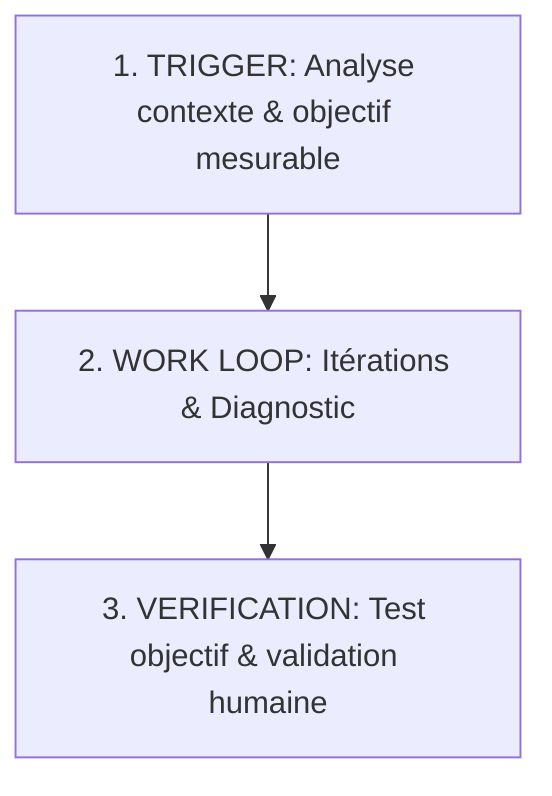

# RÈGLES DE DÉVELOPPEMENT — LOOP ENGINEERING (PARLONS IA)

Ce projet intègre les principes de l'architecture d'agent avancée **Loop Engineering** présentés dans le guide de développement de Claude Fable / Parlons IA. Tout agent travaillant sur ce projet doit s'y conformer pour garantir la qualité et l'absence d'erreurs de régression.

---

## 1. Structure de la Boucle Agentique

Toute tâche de développement doit être exécutée en suivant la boucle récursive structurée suivante :

### A. Bloc 1 : Le Trigger (Analyse de Contexte)
*   **Objectif :** Définir précisément l'objectif final et les critères mesurables de succès *avant* d'écrire la moindre ligne de code.
*   **Actions :** 
    *   Vérifier les dépendances et l'état de l'environnement (pas de dossier ou de fichier manquant).
    *   Identifier et isoler les conflits potentiels (collisions de noms de fichiers, variables globales ou styles CSS).

### B. Bloc 2 : Le Work Loop (Itérations & Diagnostic)
*   **Objectif :** Développer de manière itérative avec un diagnostic continu des erreurs.
*   **Actions :**
    *   **Freins objectifs (Brakes) :** Limiter toute boucle à un maximum de 3 tentatives de correction par sous-tâche. Si l'erreur persiste, s'arrêter pour réanalyser la stratégie globale.
    *   **Auto-tests :** Exécuter le code ou le script de compilation localement pour obtenir un retour immédiat en cas d'erreur de syntaxe ou d'exécution.

### C. Bloc 3 : La Vérification (Validation Stricte)
*   **Objectif :** Valider objectivement le travail avant de clore l'intervention.
*   **Actions :**
    *   **Test objectif :** Vérifier que les fichiers générés sont bien formés, que les encodages (UTF-8) sont respectés et que les balises HTML/CSS sont intègres.
    *   **Test de non-régression :** Vérifier que les fonctionnalités précédemment validées par l'utilisateur (comme le sélecteur global de langue ou les styles de la modal) fonctionnent toujours de manière optimale.
