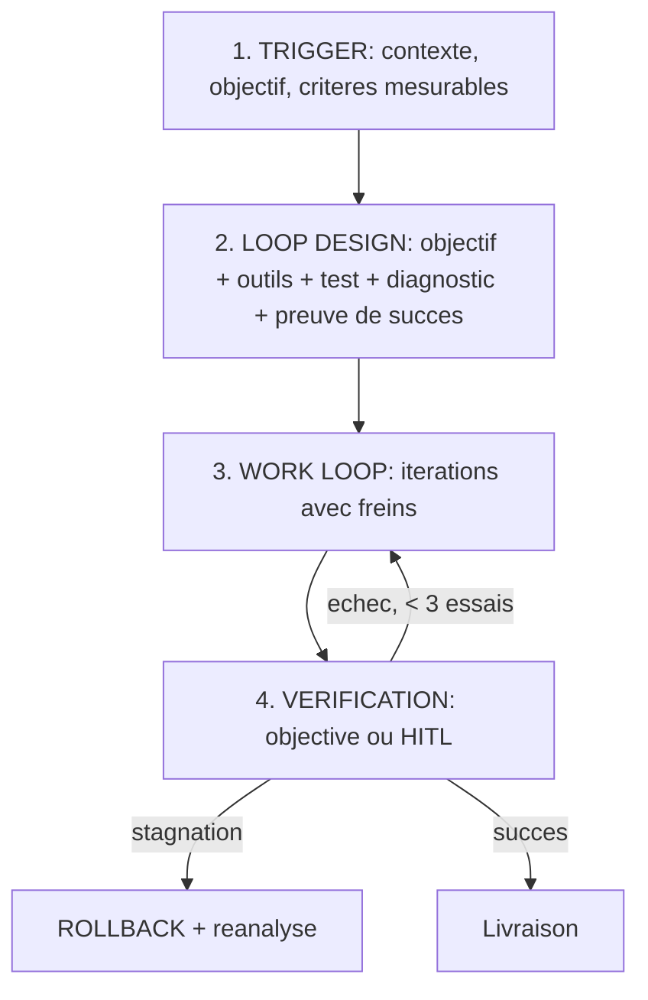

# RÈGLES DE DÉVELOPPEMENT — LOOP ENGINEERING V2 (PARLONS IA)

Ce projet intègre l'architecture d'agent **Loop Engineering** (guide Claude Fable / Parlons IA, vidéo « Comment transformer Claude Fable 5 en superintelligence », juillet 2026). Tout agent IA travaillant sur ce projet (Claude, Cursor, opencode, GLM/Hermes ou autre) doit s'y conformer. L'architecture est indépendante du modèle : elle doit fonctionner à l'identique sur un LLM moins cher.

---

## 1. Structure de la boucle agentique

### Bloc 1 : Trigger (analyse de contexte)
* Définir l'objectif final ET les critères mesurables de succès *avant* toute ligne de code.
* Identifier périmètre, données d'entrée, contraintes, risques.
* Vérifier dépendances et état de l'environnement (fichiers/dossiers présents, pas de collisions de noms, variables globales, styles CSS).

### Bloc 2 : Loop Design (conception de la boucle)
Avant d'itérer, expliciter les 5 composants de la boucle de travail :
1. **Objectif** — le livrable précis.
2. **Outils** — ce qui est disponible (scripts du dépôt, shell, skills).
3. **Test** — comment on vérifie automatiquement (commande, script, comptage).
4. **Diagnostic** — comment on isole la cause d'un échec.
5. **Preuve de succès** — ce qui, objectivement, permet de dire « terminé ».

**Bifurcation obligatoire** : si la tâche est *subjective* (design, ton éditorial, choix pédagogique) et qu'aucun critère objectif n'existe, NE PAS boucler. Demander à l'utilisateur : « Quels tests dois-je mener pour valider ce travail ? », puis enregistrer sa réponse dans la mémoire persistante (voir §3). Boucler sans critère mesurable fait entrer le modèle en zone d'inflexion : il consomme des tokens sans produire.

### Bloc 3 : Work Loop (itérations avec freins)
* **Frein d'essais** : maximum **3 tentatives** de correction par sous-tâche. Au-delà : stop, rollback à l'état stable, réanalyse de la stratégie globale.
* **Détection de stagnation** : si deux itérations produisent la même erreur ou le même diff, c'est une stagnation — ne pas retenter la même approche.
* **Rollback** : avant toute modification risquée d'un fichier généré ou partagé (ex. `website/index.html`), conserver un état restaurable (git ou copie). Savoir revenir en arrière fait partie de la boucle.
* **Auto-tests** : exécuter le code/script localement à chaque itération pour un retour immédiat.
* **Heartbeat (tâches longues)** : pour toute boucle > 10 étapes, consigner l'avancement dans la mémoire temporaire (étape courante, prochain jalon) afin qu'un humain — ou un autre agent — puisse constater l'état du système et reprendre le travail.

### Bloc 4 : Vérification
* **Objective** quand c'est possible : fichiers bien formés, UTF-8, HTML/CSS intègres, JSON valides, nombre de blocs fr/es/en égaux, tests verts.
* **HITL Review** quand une incertitude subsiste sur une tâche subjective : suspendre la tâche concernée (pas tout le processus), poser une question précise, puis **stocker la consigne reçue** comme règle d'apprentissage réutilisable.
* **Non-régression** : re-vérifier les fonctionnalités déjà validées par l'utilisateur (sélecteur global de langue, boutons de traduction par paragraphe, glossaire, quiz, styles de la modal).

---

## 2. Routing : orchestrateur → skills

Ce fichier est l'**orchestrateur**. Ne pas charger toutes les procédures en contexte : router vers la compétence spécialisée au moment où la tâche se présente (injection de contexte courte et significative — les performances d'un LLM chutent quand le contexte se remplit).

| Tâche | Skill à charger |
|---|---|---|
| Rédiger un dossier de debunking trilingue | `.agents/skills/debunk-dossier.md` |
| Vérifier une affirmation, une image, une annonce | `.agents/skills/fact-check-express.md` |
| Évaluer datations, imagerie, preuves archéologiques | `.agents/skills/preuves-historiques.md` |
| Publier sur le site, images, carrousel Instagram | `.agents/skills/nexome-publication.md` |
| Exploiter un dossier en classe de FLE / quiz didactique | `.agents/skills/debunk-vers-fle.md` |
| Audit complet d'une app (sécurité, RGPD, qualité) | `.agents/skills/audit-integral.md` |
| Design UI/UX du site | `.agents/skills/design-ui-ux.md` |
| Système d'apprentissage gamifié | `.agents/skills/ingenierie-didactique.md` |
| Matériel de classe FLE générique | `.agents/skills/fle-course-materials.md` |

Si une compétence manque et que la tâche est récurrente, proposer de **créer une nouvelle skill** (procédure standardisée) plutôt que de résoudre ponctuellement.

---

## 3. Architecture mémoire (3 niveaux, dans `.agents/`)

| Fichier | Rôle | Cycle de vie |
|---|---|---|
| `memory.md` | **Mémoire persistante** : décisions validées, critères de succès appris via HITL, préférences de l'utilisateur, règles de non-régression | Ne se nettoie jamais ; s'enrichit à chaque session |
| `memory_temp.md` | **Mémoire temporaire auto-nettoyante** : plan de la tâche en cours, étapes, heartbeat | Se vide quand la tâche est livrée |
| `exchange.md` | **Fichier d'échange** entre agents/skills : données brutes qu'une étape passe à la suivante sans les recompresser en prose | Se vide quand le pipeline est terminé |

Règles :
* **Début de session** : lire `memory.md`, puis `memory_temp.md` (une tâche est peut-être en cours — la reprendre au lieu de repartir de zéro).
* **Pendant la tâche** : tenir `memory_temp.md` à jour par blocs d'étapes ; y noter chaque décision HITL en attente.
* **Fin de tâche** : transférer dans `memory.md` ce qui a valeur de règle durable (critères appris, pièges découverts), puis nettoyer `memory_temp.md` — **sans toucher** à `exchange.md` si un autre agent/skill n'a pas fini de consommer les données.
* Entre skills, passer les **données brutes** via `exchange.md` (listes, JSON, extraits) plutôt que des résumés en prose : la compression en texte perd de l'information.

---

## 4. Contrat qualité du dépôt (rappels invariants)

* Encodage **UTF-8** partout ; balises HTML/CSS intègres.
* Ne jamais supprimer les placeholders `<!-- FEATURED_START/END -->` et `<!-- DOSSIERS_START/END -->` d'`index.html`.
* Dossiers trilingues : blocs `\n\n` alignés fr/es/en (compter avant publication).
* `*.didactic.json` : JSON valide (`python -m json.tool`) avant `publish_dossiers.py`.
* Toute affirmation factuelle publiée = source primaire identifiable (DOI) — voir `debunk-dossier`.
